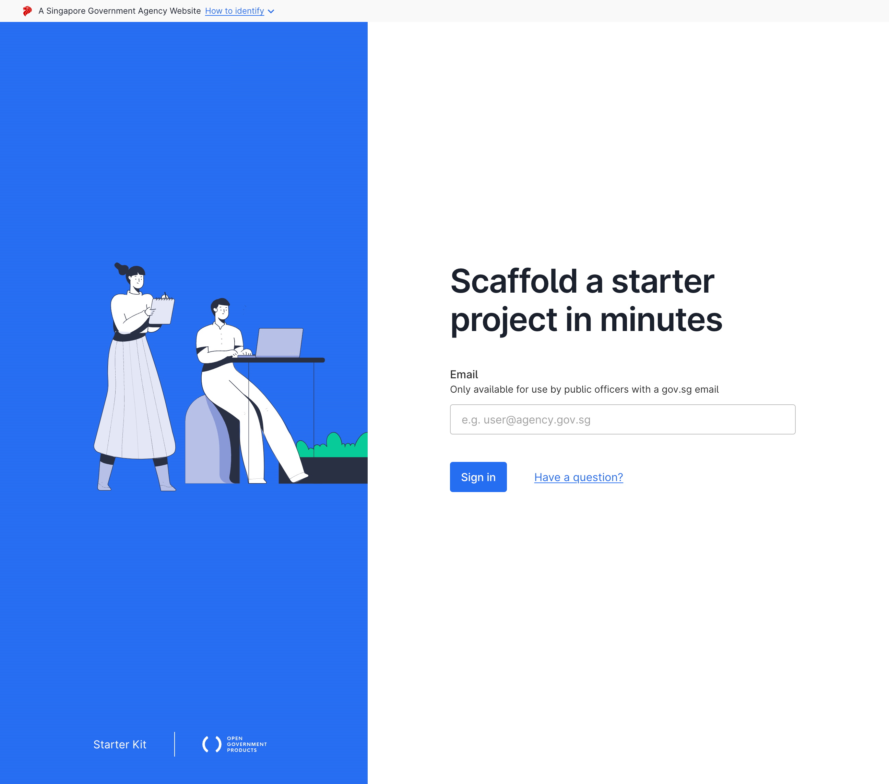

# TypeScript Project Files Template for OGP

A template used by [Open Government Products](https://open.gov.sg)
to build new products

## Quickstart

```
# Clone this repo if you're trying this out, or start a new repo with
# ts-template as a template and clone that if starting a new product

git clone git@github.com:opengovsg/ts-template
cd ts-template
npm install
npm run dev
```

## Getting Started

This guide should equip you with the basics you’ll need to build and 
launch a simple product, using this as a starting point, even if you 
don’t have a background in software engineering.

### Preparation - installing software

You will need the following:
- [Docker Desktop](https://www.docker.com/)
- An application to edit files, like Microsoft's [Visual Studio Code](https://code.visualstudio.com/)
- A client to interact with GitHub, like its [official desktop client](https://desktop.github.com/)
- Some familiarity with using the [Terminal in Mac OS X](https://www.youtube.com/watch?v=aKRYQsKR46I)
- [Volta](https://volta.sh/), by entering into the Terminal the 
  commands listed on their homepage
  - Using Volta, install the following software:
    - Node.js - `volta install node`
    - npm - `volta install npm`

### Getting and Preparing the Code in Your Computer

- Create a [new repository](https://github.com/new), using
  opengovsg/ts-template as a template:  
  
- Use [GitHub Desktop](https://docs.github.com/en/desktop/contributing-and-collaborating-using-github-desktop/adding-and-cloning-repositories/cloning-and-forking-repositories-from-github-desktop)
  (or your preferred tool) to clone your newly-created repository into 
  your computer
- In your terminal, open the directory containing the local repository 
  and the template code, and run the command `npm install`
    - This pulls in third-party packages for the codebase, which it
      depends on to run (ie, dependencies)
- In the same terminal, run `npm run dev` to verify that the application
  has been prepared correctly. Your browser should display the following:  
  

## Further Reading

Take time to understand the codebase and what you have to work with
to further develop your product.

- An index to all the documentation can be found [here](/docs/).
- In a hurry to launch your product? Go straight to [deploying](/docs/deploying/)
